## 友情提示
> 1. **快速体验项目**：[在线访问地址](http://www.toponlineweb.top) 。
> 2. **项目交流**：想要交流项目的朋友，可以加[3533643117](#QQ号) 。


## 前言

`manager-system`项目致力于打造一个完整的后台管理系统，采用现阶段流行技术实现。


## 项目介绍

`manager-system`项目是一个商城后台管理系统的前端项目，基于Vue+Element实现，采用Docker容器化部署。主要包含后台面板、商品管理、用户管理、订单管理、管理员管理、系统设置、分销模块、统计报表等功能。


## 项目演示

前端项目`manager-system`地址：https://github.com/Fu-Huan-Mei/manage-system.git

项目在线演示地址： [http://www.toponlineweb.top](http://www.toponlineweb.top)  
- 用户名：admin
- 密码：admin

项目展示：
- 后台首页
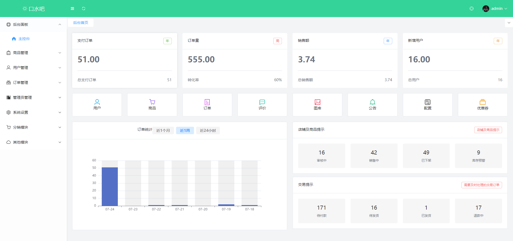
- 商城管理
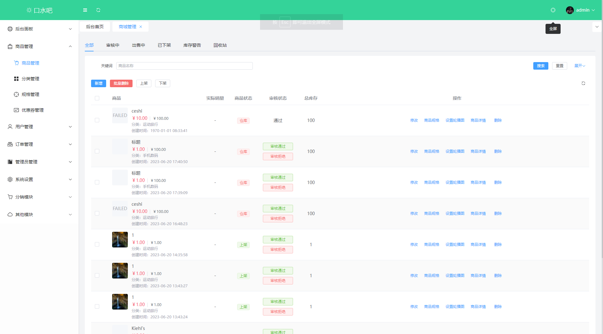
- 分类管理
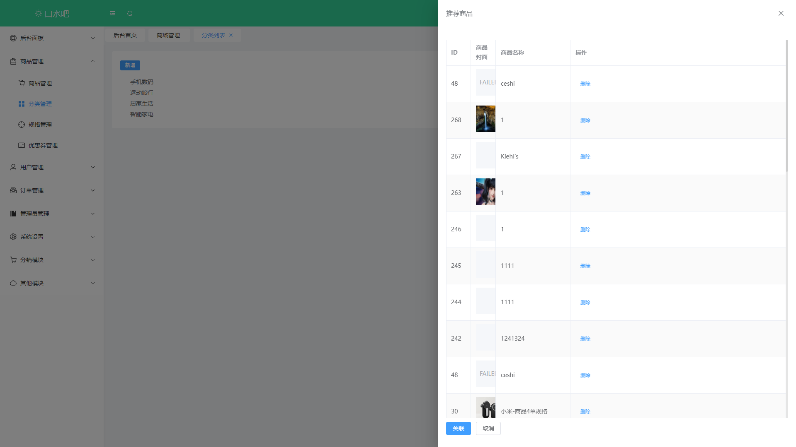
- 规格管理
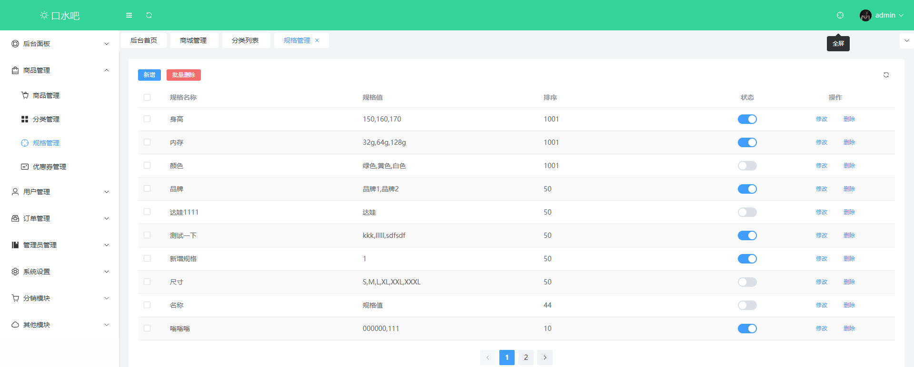
- 优惠券列表
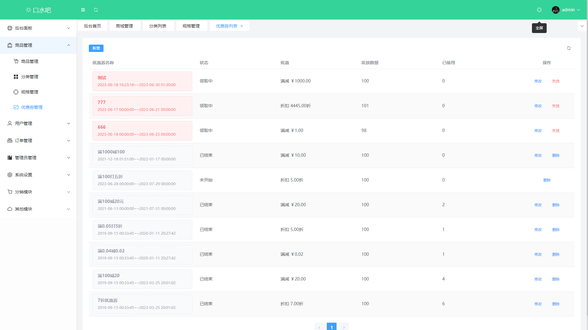
- 用户列表
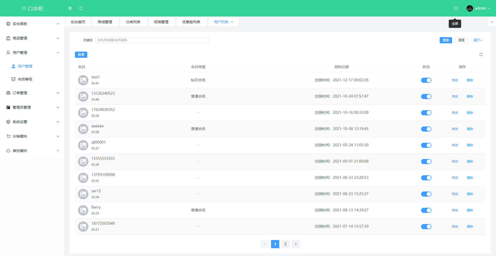
- 会员等级
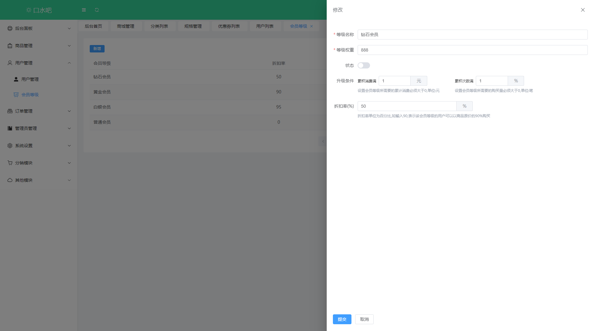
- 订单列表
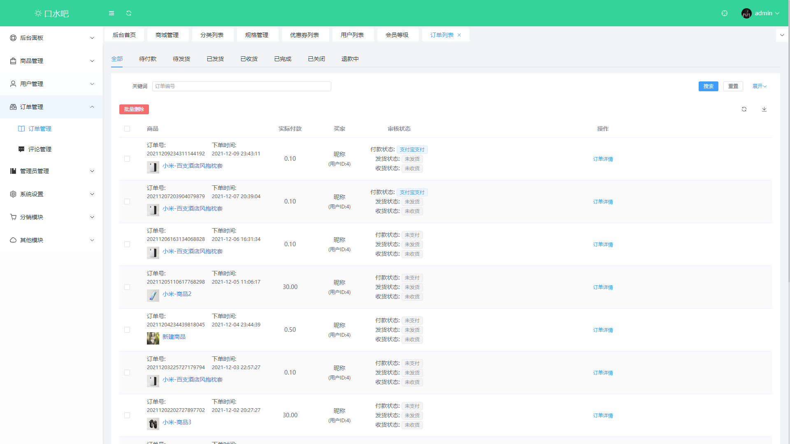 
- 评价列表
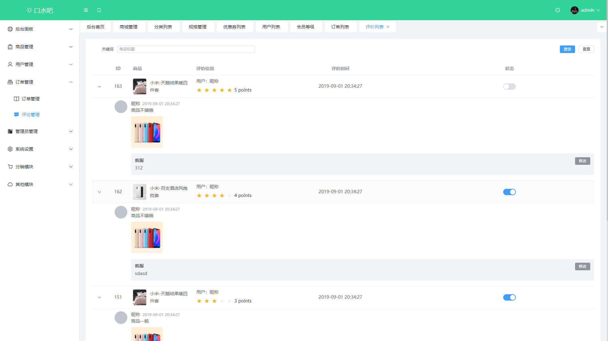
- 管理员列表
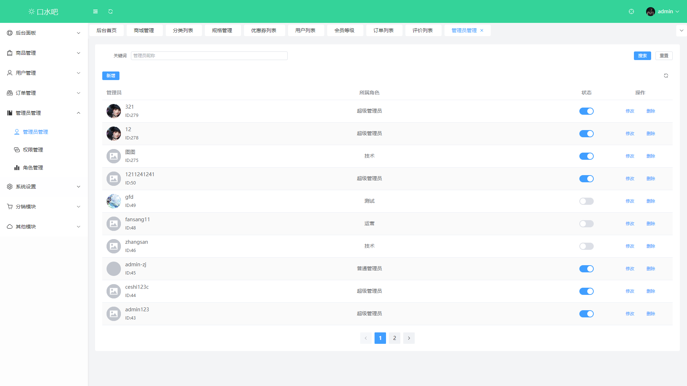
- 菜单权限管理
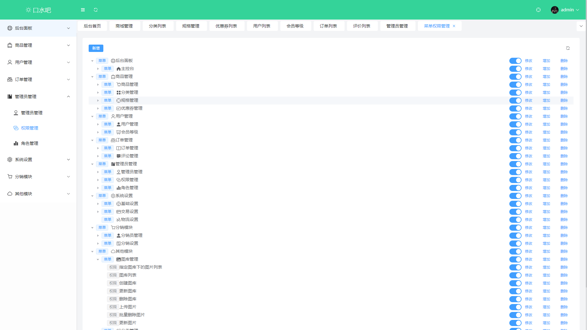
- 角色管理
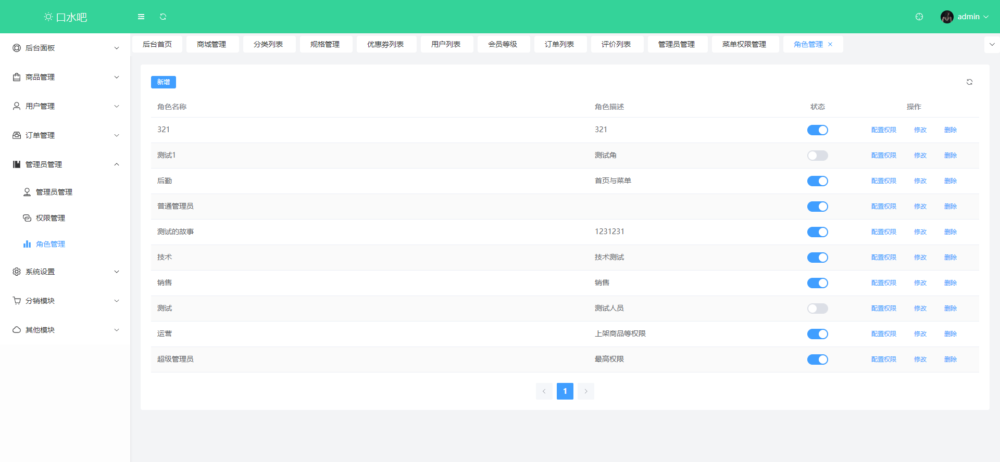
- 配置列表
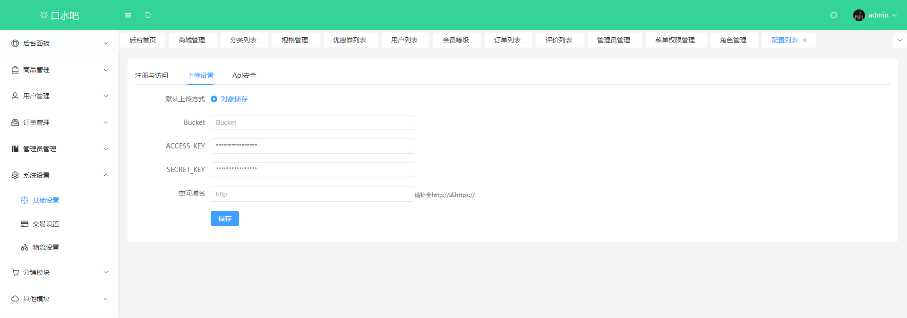
- 交易设置
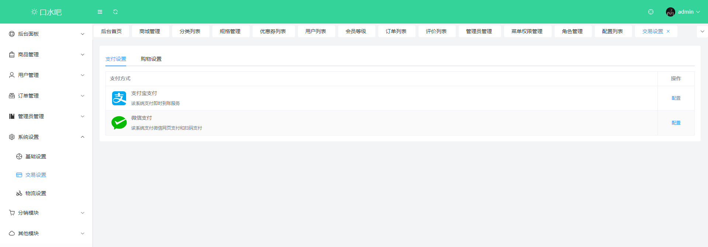
- 物流设置
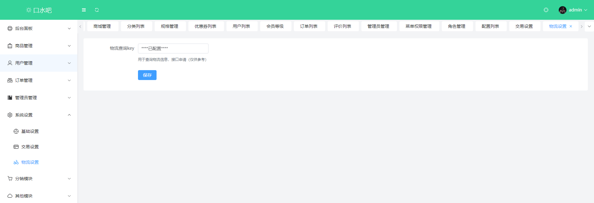 
- 分销员管理
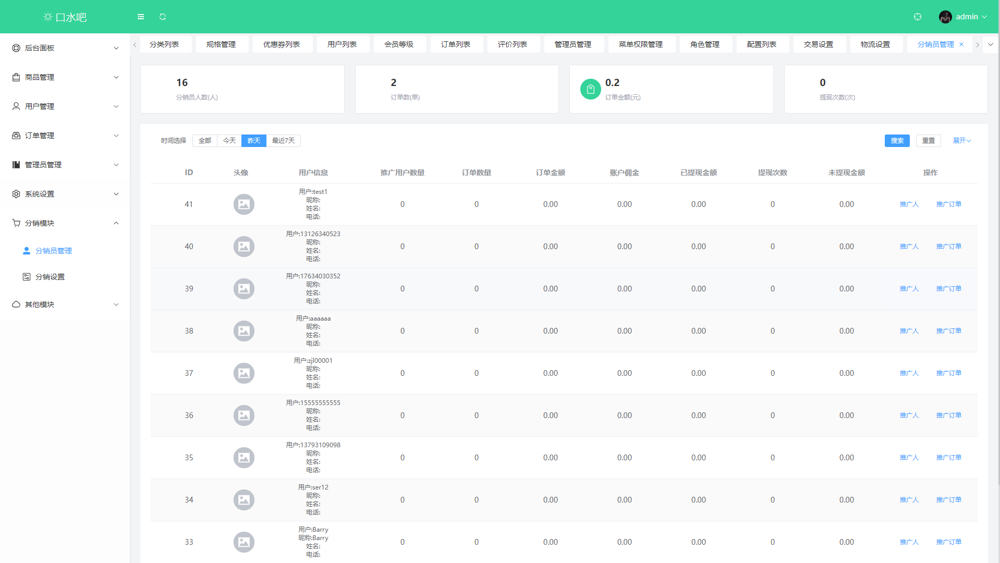 
- 分销设置
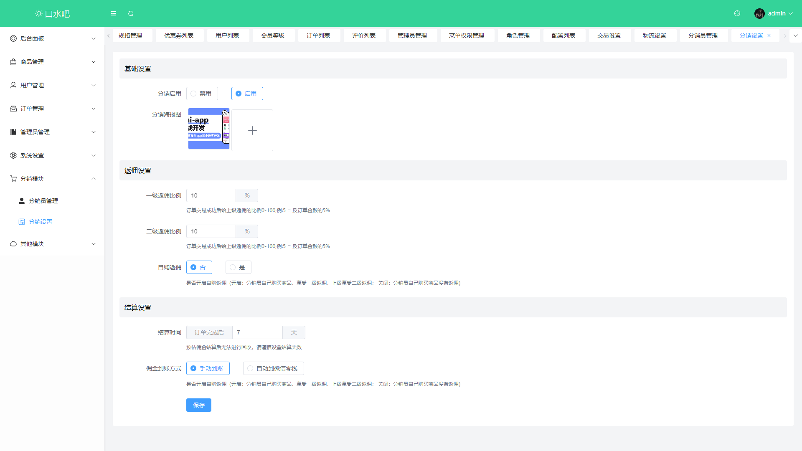 
- 图库列表
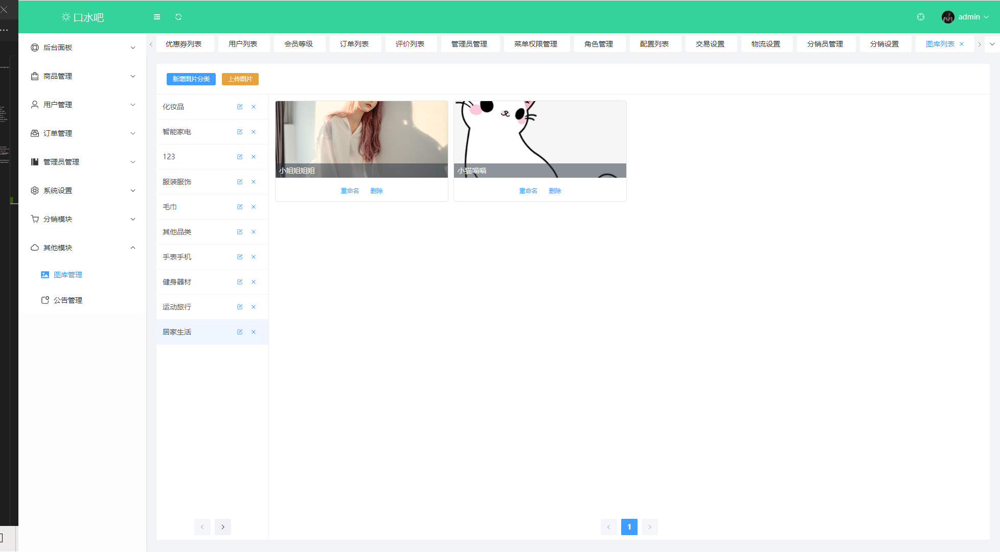
- 公告列表
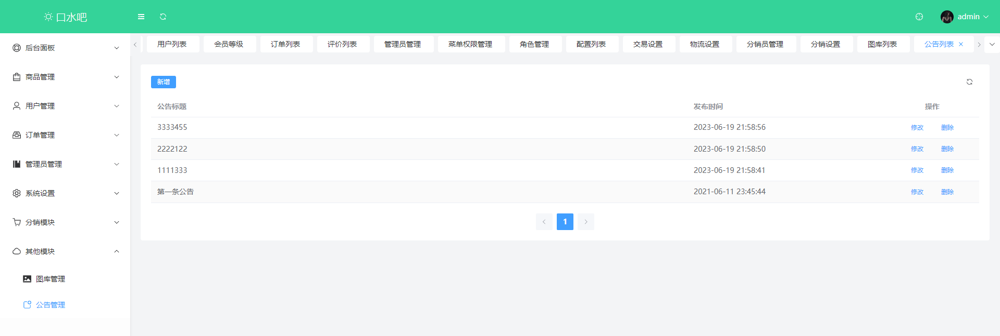


## 技术选型

| 技术              | 说明                   | 官网                                                         |
| ----------------- | --------------------- | ------------------------------------------------------------ |
| Vue.js            | 前端框架,版本号为 3.2.47| [https://v3.vuejs.org/](https://v3.vuejs.org/)                     |
| Vue Router        | 路由管理器,版本号为 4.2.1 | [https://router.vuejs.org/](https://router.vuejs.org/)       |
| Vuex              | 全局状态管理库,版本号为 4.0.2| [https://vuex.vuejs.org/](https://vuex.vuejs.org/)           |
| Element Plus      | 前端UI框架,版本号为 2.3.4 | [https://element-plus.org/](https://element-plus.org/)       |
| Axios             | 基于 Promise 的 HTTP 客户端,版本号为 1.4.0| [https://axios-http.com/](https://axios-http.com/) |
|ECharts            | 数据可视化的JS图表库,版本号为 5.4.2 | [https://echarts.apache.org/en/index.html](https://echarts.apache.org/en/index.html)  |
|GSAP               |高性能的JS动画库,版本号为 3.11.5    | [https://greensock.com/gsap/](https://greensock.com/gsap/) |
|TinyMCE            | 富文本编辑器,版本号为 6.4.2       | [https://www.tiny.cloud/](https://www.tiny.cloud/) |
|Universal Cookie   | 处理浏览器 cookie 的JS库,版本号为 4.0.4 | [https://www.npmjs.com/package/universal-cookie](https://www.npmjs.com/package/universal-cookie)   |
|NProgress          |轻量级的进度条库,版本号为 0.2.0 | [https://ricostacruz.com/nprogress/](https://ricostacruz.com/nprogress/) |
|VueUse/Core        |集成多个 Vue.js 的实用工具库,版本号为 10.1.2| [https://vueuse.org/core/](https://vueuse.org/core/) |
|VueUse/Integrations|包含多个 Vue.js 集成插件库,版本号为 10.1.2  | [https://vueuse.org/integrations/](https://vueuse.org/integrations/) |


## 插件
| 插件              | 说明                                                     | 官网                                                         |
| ----------------- | ------------------------------------------------------- | ------------------------------------------------------------ |
| Vite              | 一个快速的构建工具和开发服务器，版本号为 4.3.2| [https://vitejs.dev/](https://vitejs.dev/)                     |
| @vitejs/plugin-vue| 一个 Vite 插件，用于支持 Vue.js 单文件组件，版本号为 4.1.0| [https://cn.vitejs.dev/plugins/](https://cn.vitejs.dev/plugins/dev/)               |
|vite-plugin-windicss| 一个快速的构建工具和开发服务器，版本号为 4.3.2| [https://cn.windicss.org/](https://cn.windicss.org/)                     |


## 项目布局

``` lua
src -- 源码目录
├── api -- axios网络请求定义
├── assets -- 静态图片资源文件
├── components -- 通用组件封装
├── icons -- svg矢量图片文件
├── router -- vue-router路由配置
├── store -- vuex的状态管理
├── styles -- 全局css样式
├── utils -- 工具类
└── views -- 前端页面
    ├── home -- 首页
    ├── layout -- 通用页面加载框架
    ├── login -- 登录页
    ├── oms -- 订单模块页面
    ├── pms -- 商品模块页面
    └── sms -- 营销模块页面
```

## 搭建步骤
- 下载node并安装：[https://nodejs.org/dist/v12.14.0/node-v12.14.0-x64.msi](https://nodejs.org/dist/v12.14.0/node-v12.14.0-x64.msi);
- 该项目为前后端分离项目，访问本地访问接口需搭建后台环境，搭建请参考后端项目[传送门](https://github.com/macrozheng/mall);
- 访问在线接口无需搭建后台环境，只需将`config/dev.env.js`文件中的`BASE_API`改为[https://admin-api.macrozheng.com](https://admin-api.macrozheng.com)即可;
- 如果你对接的是[mall-swarm](https://github.com/macrozheng/mall-swarm) 微服务后台的话，所有接口都需要通过网关访问，需要将`config/dev.env.js`文件中的`BASE_API`改为[http://localhost:8201/mall-admin](http://localhost:8201/mall-admin) ；
- 克隆源代码到本地，使用IDEA打开，并完成编译;
- 在IDEA命令行中运行命令：`npm install`,下载相关依赖;
- 在IDEA命令行中运行命令：`npm run dev`,运行项目;
- 访问地址：[http://localhost:8090](http://localhost:8090) 即可打开后台管理系统页面;
- 具体部署过程请参考：[mall前端项目的安装与部署](https://www.macrozheng.com/mall/deploy/mall_deploy_web.html)
- 前端自动化部署请参考：[使用Jenkins一键打包部署前端应用，就是这么6！](https://www.macrozheng.com/mall/reference/jenkins_vue.html)

